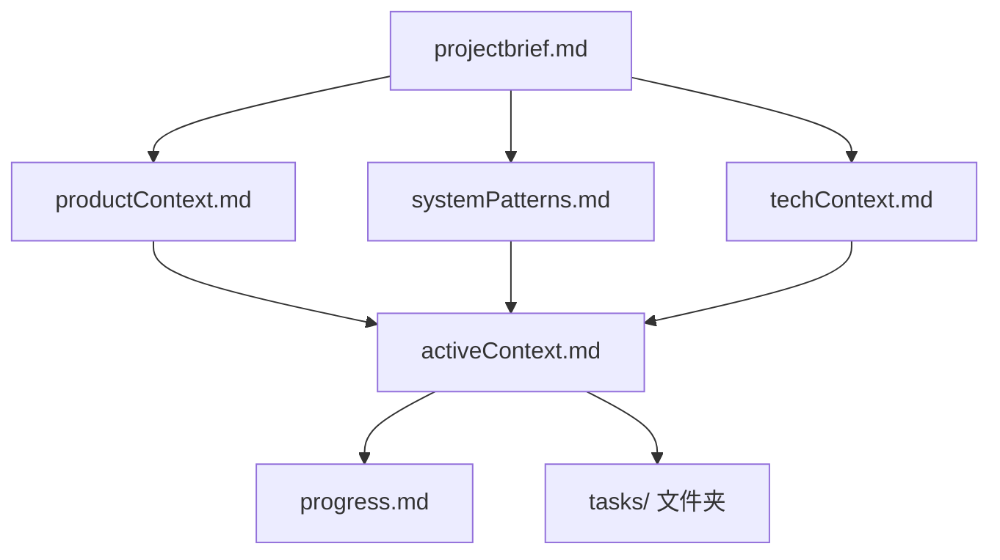

# AI 记忆库（Memory Bank）

本目录是 **TampermonkeyScripts** 项目的 **Memory Bank**——持久化的项目知识库，供 AI 助手与开发者跨会话恢复上下文、理解项目结构、代码约定与各脚本职责。遵循 `.github/instructions/memory-bank.instructions.md` 的 Memory Bank 模式。

> **AI 助手必读**：每次任务开始先按顺序读完下方「核心文件」清单，再按需查阅深度参考文档。

## 记忆库结构（文件层级）

### 核心文件（每次任务必读）

| 文件 | 内容 |
|------|------|
| [projectbrief.md](./projectbrief.md) | 项目范围、目标与基石（含仓库结构） |
| [productContext.md](./productContext.md) | 项目为何存在、解决什么问题、如何工作、用户体验目标 |
| [activeContext.md](./activeContext.md) | **当前工作焦点**、最近改动、下一步、活跃决策 |
| [systemPatterns.md](./systemPatterns.md) | 系统架构、关键技术决策、设计模式、组件关系 |
| [techContext.md](./techContext.md) | 技术栈、开发环境、技术约束、依赖 |
| [progress.md](./progress.md) | 已实现 / 待办 / 现状 / 已知问题 |
| [tasks/_index.md](./tasks/_index.md) | 任务清单（按状态分类） |

### 深度参考文档（附加上下文，按需阅读）

| 文档 | 内容 |
|------|------|
| [conventions.md](./conventions.md) | 铁律（计划不改码/等审核/版本号/知识库同步）、提交信息规范、测试约定、检查清单、开发与发布工作流 |
| [pitfalls.md](./pitfalls.md) | 已知易错点与坑（含现存 Bug 清单，症状→原因→对策） |
| [tasks/_index.md](./tasks/_index.md) | 任务清单（按状态分类，路线图角色由此承担） |
| [scripts/PTAutoCheckIn.md](./scripts/PTAutoCheckIn.md) | PT 多站点自动签到 v2（常驻调度批量 + FAB 面板 + 贴吧多吧，站点/单元配置驱动） |
| [scripts/BTSchoolHelper.md](./scripts/BTSchoolHelper.md) | BTSchool 种子列表高亮 + 快捷键滚动脚本 |
| [scripts/BilibiliEnterFullscreen.md](./scripts/BilibiliEnterFullscreen.md) | B 站 Enter 键全屏切换脚本 |
| [scripts/EnhanceVisitedLinks.md](./scripts/EnhanceVisitedLinks.md) | 全局已访问链接样式增强脚本 |

## 如何阅读

- **首次接触项目**：先读 `projectbrief.md`，了解项目范围与仓库结构；再按需阅读对应脚本文档。
- **修改某个脚本**：直接阅读该脚本的文档页（`memory-bank/scripts/*.md`）+ 源文件（`src/*.user.js`）。
- **动手写代码前**：阅读 `conventions.md`（约定）与 `pitfalls.md`（易错点），避免重踩历史 Bug。
- **排障/查现状**：优先查 `pitfalls.md` 的症状→原因对照表，其次看脚本内 `[ScriptName]` 日志。
- **规划改动**：参考 `tasks/_index.md` 中已登记的待办与方向。
- **新增脚本**：参考 `conventions.md` 第 7 节检查清单，完成后在本文档与知识库中补充登记。
- **需要真实页面 HTML**：`src/BTSchoolTorrentsTableSample.html` 是 BTSchool 种子表格的真实 HTML 样本，用于验证解析逻辑。

## 快速提醒

1. **协作纪律：计划不改码**——任务为计划/分析时禁止修改代码；实施类修改完成后**等用户审核、不自动提交**（git commit/push 由用户执行）。详见 `conventions.md` 第 0 节。
2. **铁律：版本号**——`@version YYYY.MM.DD.N`，**修改代码/元数据必须同步递增**并与代码同次提交（纯注释/仅改 `memory-bank/` 文档除外）；详见 `conventions.md` 第 0/1 节。
3. **铁律：知识库同步**——更新代码/项目文档后**必须同步更新 `memory-bank/` 记忆库**并同次提交；详见 `conventions.md` 第 0.4 / 6 节。
4. **提交信息规范且详细**——首行概括 + 正文分条；一次提交只做一件事。格式见 `conventions.md` 第 1 节。
5. **测试纪律**——可设计易测代码，但**不给测试留后门/通道**、**不为通过测试修改生产代码**；详见 `conventions.md` 第 8 节。
6. **标点**：注释/日志用中文但统一**英文标点**。
7. **解析易错**：BTSchool 表格用 `tbody > tr:has(> td.rowfollow)` 定位行、`:scope > td` 取列；浮点属性（时魔）不可用整数解析函数。
8. **自测**：改动后在真实站点页面 F12 看 console；详尽的症状/原因/对策见 `pitfalls.md`。